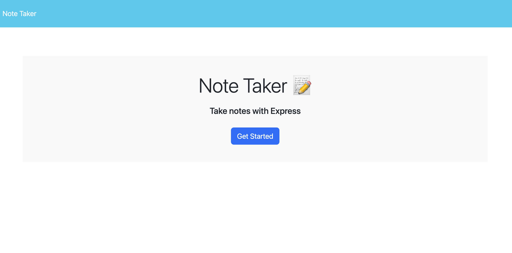

# note-taker

## Description
Note-Taker is an application that can be used to write and save notes. With the front-end code provided, I wrote the back-end using Express.js to save and retrieve note data. The application is deployed using Heroku.

## Usage

Visit the deployed app [here](https://note-taker-10-23-30783c9d1a20.herokuapp.com/).

## Credits
Tutor - Bobbi Tarkany

## License
This application is covered under the MIT license.